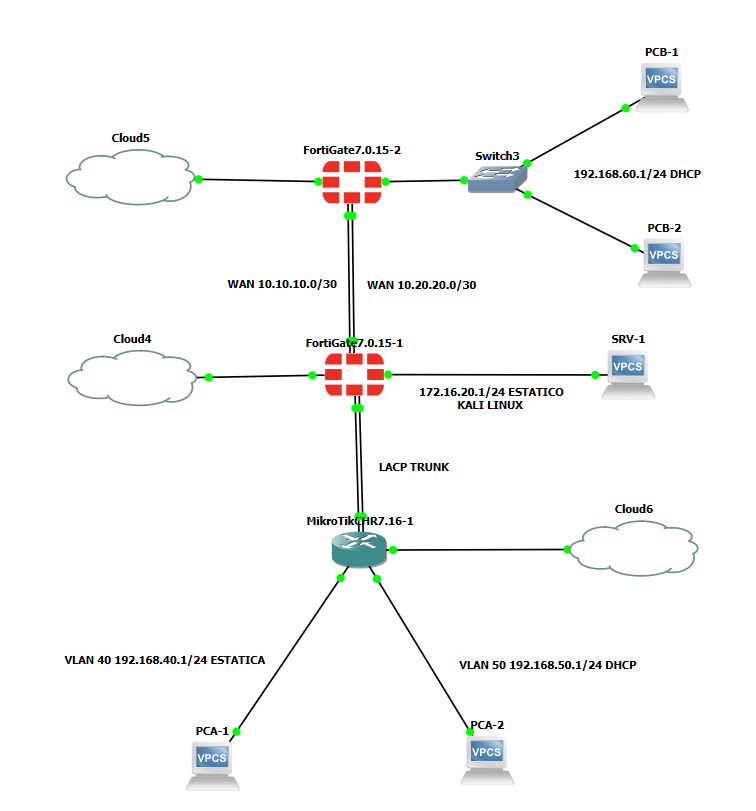
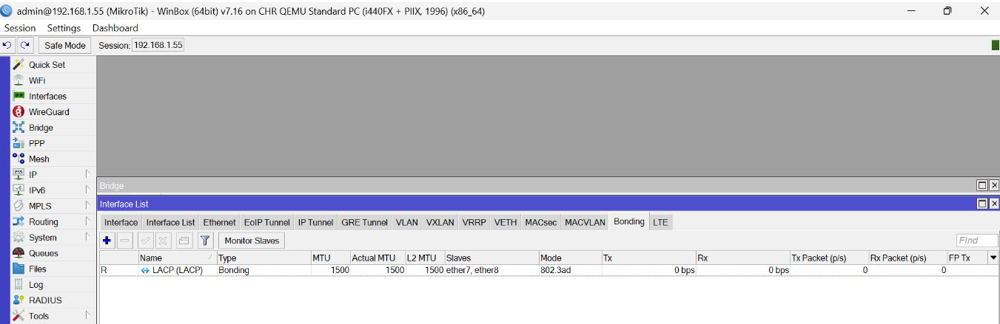
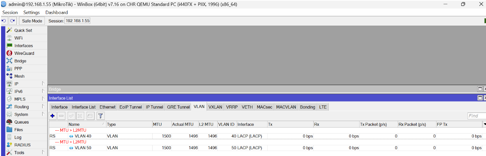
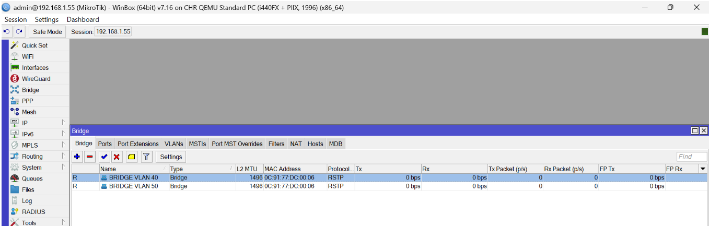
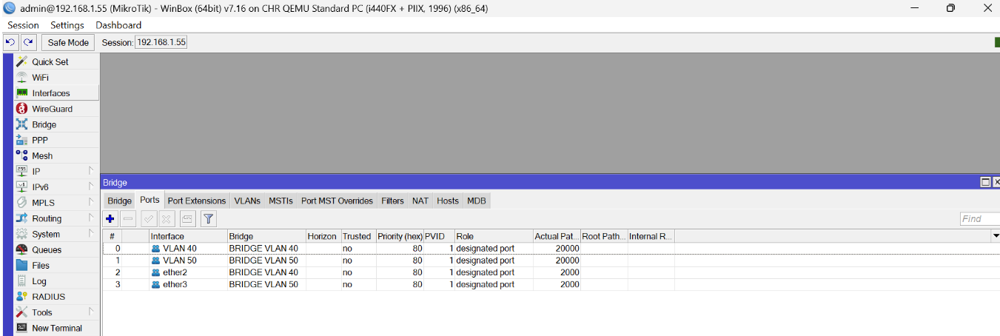

# FortiGate — Laboratorio Multi-Sitio: ECMP, LACP, VLANs y NAT

Laboratorio integral de **dos sedes interconectadas** con FortiGate que consolida en una sola topología los pilares de administración de FortiOS: segmentación por VLANs sobre LACP, DHCP, enrutamiento estático con ECMP, políticas de firewall inter-sitio y publicación de servicios con SNAT/DNAT (VIP).

Contenido alineado al temario de **FortiOS Administrator (NSE4)**.

> ⚠️ Laboratorio en entorno controlado con fines de práctica y aprendizaje, no un despliegue en producción.
>
> Nomenclatura de interfaces: se usa port1–port8 (FortiOS).

## 1. Topología general

- **SITE A (sede principal — FW-SITE-A):** salida a Internet por port1, zona de servidores en port5 (SRV-1 con Apache) y zona de usuarios segmentada en VLAN 40 y VLAN 50 sobre un trunk LACP (port7+port8) hacia un switch MikroTik MK).
- **Interconexión WAN:** dos enlaces punto a punto redundantes entre ambos firewalls, balanceados con **ECMP** (rutas estáticas de igual distancia administrativa y prioridad).
- **SITE B (sede remota — FW-SITE-B):** salida a Internet por port1 y LAN plana 192.168.60.0/24 en port5 hacia un switch L2 no administrado, con DHCP para los hosts.
- **"Internet" del laboratorio:** el segmento 192.168.1.0/24 (gateway 192.168.1.1) simula la nube pública; ambos firewalls obtienen su IP WAN por DHCP en él.



## 2. Plan de direccionamiento

| Segmento | Red | Gateway | Asignación |
|---|---|---|---|
| "Internet" del lab | 192.168.1.0/24 | 192.168.1.1 | port1 FW-A: **192.168.1.40** (DHCP) · port1 FW-B: **192.168.1.41** (DHCP) |
| Servidores — Site A (port5) | 172.16.20.0/24 | 172.16.20.1 | SRV-1 estática: **172.16.20.2** |
| VLAN 40 — PCA-1 (Site A) | 192.168.40.0/24 | 192.168.40.1 | PCA-1 estática: **192.168.40.2** |
| VLAN 50 — PCA-2 (Site A) | 192.168.50.0/24 | 192.168.50.1 | DHCP: 192.168.50.2–254 |
| WAN 1 inter-sitio | 10.10.10.0/30 | — | FW-A: 10.10.10.1 · FW-B: 10.10.10.2 |
| WAN 2 inter-sitio | 10.20.20.0/30 | — | FW-A: 10.20.20.1 · FW-B: 10.20.20.2 |
| LAN — Site B (port5) | 192.168.60.0/24 | 192.168.60.1 | DHCP: 192.168.60.2–254 (PCB-1, PCB-2) |

> La LAN del Sitio B se definió en 192.168.60.0/24 para evitar solapamiento con las redes del Sitio A. Las IPs WAN se reciben por DHCP, por lo que pueden variar entre sesiones del laboratorio; para fijarlas, reservar la MAC en el servidor DHCP del segmento 192.168.1.0/24.

## 3. SITE A — FW-SITE-A

**Interfaces**

| Puerto | Función | Detalle |
|---|---|---|
| port1 | Internet (192.168.1.0/24) | DHCP — 192.168.1.40 |
| port2 | WAN1 inter-sitio | 10.10.10.1/30 |
| port3 | WAN2 inter-sitio | 10.20.20.1/30 |
| port5 | Zona de servidores | 172.16.20.1/24 — SRV-1 (Apache) conectado directo |
| port7 + port8 | LACP (802.3ad) hacia MK | Trunk con VLAN 40 y VLAN 50 |

**LACP + subinterfaces VLAN (CLI de referencia):**

```
config system interface
    edit "LACP-USERS"
        set type aggregate
        set member "port7" "port8"
    next
    edit "VLAN40"
        set interface "LACP-USERS"
        set vlanid 40
        set ip 192.168.40.1 255.255.255.0
        set allowaccess ping
    next
    edit "VLAN50"
        set interface "LACP-USERS"
        set vlanid 50
        set ip 192.168.50.1 255.255.255.0
        set allowaccess ping
    next
end
```

**DHCP en VLAN50** (direccionamiento de PCA-2): rango por defecto 192.168.50.2–192.168.50.254, gateway 192.168.50.1, DNS del sistema.

**Switch MikroTik (MK):** bonding 802.3ad en sus puertos 7 y 8 hacia el FortiGate, VLANs 40 y 50 etiquetadas sobre el bond, y puertos de acceso: PCA-1 en VLAN 40, PCA-2 en VLAN 50.

**Configuración del MikroTik (capturas):**

Bond LACP (802.3ad) con ether7 + ether8:



VLAN 40 y VLAN 50 sobre el bond LACP:



Bridges por VLAN (BRIDGE VLAN 40 y BRIDGE VLAN 50):



Puertos de los bridges (VLAN 40/50 y accesos ether2/ether3):



## 4. Interconexión WAN — Enrutamiento estático con ECMP

**Rutas en FW-SITE-A** (cada par inter-sitio con la misma distancia y prioridad → ECMP):

| Destino | Gateway | Interfaz |
|---|---|---|
| 192.168.60.0/24 | 10.10.10.2 | port2 |
| 192.168.60.0/24 | 10.20.20.2 | port3 |
| 0.0.0.0/0 (Internet) | 192.168.1.1 | port1 — aprendida por DHCP |

**Rutas en FW-SITE-B:**

| Destino | Gateway | Interfaz |
|---|---|---|
| 172.16.20.0/24 | 10.10.10.1 | port2 |
| 172.16.20.0/24 | 10.20.20.1 | port3 |
| 192.168.40.0/24 | 10.10.10.1 | port2 |
| 192.168.40.0/24 | 10.20.20.1 | port3 |
| 192.168.50.0/24 | 10.10.10.1 | port2 |
| 192.168.50.0/24 | 10.20.20.1 | port3 |
| 0.0.0.0/0 (Internet) | 192.168.1.1 | port1 — aprendida por DHCP |

> Al estar port1 en DHCP, la ruta por defecto se aprende automáticamente del servidor ("Retrieve default gateway from server"). Verificable con get router info routing-table all (línea S* 0.0.0.0/0 via 192.168.1.1).

**Modo de balanceo ECMP.** FortiOS soporta cuatro modos config system settings → set v4-ecmp-mode):

| Modo | Comportamiento |
|---|---|
| source-ip-based (default) | Reparte por IP de origen: cada host usa siempre el mismo enlace |
| **source-dest-ip-based** | Reparte por par origen+destino: un host puede usar ambos enlaces |
| weight-based | Reparte según pesos asignados a cada ruta |
| usage-based | Spillover: enlace principal hasta un umbral, luego desborda al secundario |

**Modo configurado en este laboratorio: source-dest-ip-based** — elegido en lugar del default para que el balanceo sea observable desde un mismo host: al variar el destino, las sesiones se reparten entre WAN1 y WAN2.

## 5. SITE B — FW-SITE-B

| Puerto | Función | Detalle |
|---|---|---|
| port1 | Internet (192.168.1.0/24) | DHCP — 192.168.1.41 |
| port2 | WAN1 inter-sitio | 10.10.10.2/30 |
| port3 | WAN2 inter-sitio | 10.20.20.2/30 |
| port5 | LAN usuarios | 192.168.60.1/24 → switch L2 no administrado → PCB-1, PCB-2 |

**DHCP en port5:** rango por defecto 192.168.60.2–192.168.60.254, gateway 192.168.60.1, DNS del sistema.

## 6. Matriz de conectividad requerida

| # | Origen | Destino | Ruta | Validado |
|---|---|---|---|---|
| 1 | PCA-2 (VLAN50) | SRV-1 | Intra-sitio A | ☐ |
| 2 | SRV-1 | PCB-2 | Inter-sitio (ECMP) | ☐ |
| 3 | PCB-1 | PCA-2 | Inter-sitio (ECMP) | ☐ |
| 4 | PCB-2 | PCA-1 y PCA-2 | Inter-sitio (ECMP) | ☐ |
| 5 | SRV-1 | Internet (salida) | SNAT en port1 | ☐ |
| 6 | Segmento 192.168.1.0/24 ("Internet") | SRV-1 — Apache :80 | DNAT/VIP en port1 | ☐ |

> FortiGate es stateful: la política que permite el tráfico de ida también deja volver la respuesta por la misma sesión. Solo se necesita política inversa si el otro extremo debe **iniciar** tráfico.

## 7. Políticas de firewall

**FW-SITE-A**

| # | Nombre | Src intf | Dst intf | Origen | Destino | Servicio | NAT |
|---|---|---|---|---|---|---|---|
| 1 | VLAN50-to-SRV | VLAN50 | port5 | 192.168.50.0/24 | 172.16.20.0/24 | PING | No |
| 2 | SRV-to-SiteB | port5 | port2, port3 | 172.16.20.0/24 | 192.168.60.0/24 | PING | No |
| 3 | SiteB-to-Users | port2, port3 | VLAN40, VLAN50 | 192.168.60.0/24 | 192.168.40.0/24, 192.168.50.0/24 | PING | No |
| 4 | SRV-to-Internet | port5 | port1 | 172.16.20.0/24 | all | ALL | **Sí (SNAT)** |
| 5 | Internet-to-SRV | port1 | port5 | all | VIP_SRV1_HTTP | HTTP | No* |

\* El DNAT lo realiza el objeto VIP; la política que lo referencia no lleva NAT.

**FW-SITE-B**

| # | Nombre | Src intf | Dst intf | Origen | Destino | Servicio | NAT |
|---|---|---|---|---|---|---|---|
| 1 | LAN-to-SiteA | port5 | port2, port3 | 192.168.60.0/24 | 192.168.40.0/24, 192.168.50.0/24 | PING | No |
| 2 | SiteA-to-LAN | port2, port3 | port5 | 172.16.20.0/24 | 192.168.60.0/24 | PING | No |

> Diseño: el tráfico **inter-sitio viaja sin NAT** — ambos firewalls ven las IPs reales y las políticas se escriben por subred origen/destino, lo que mejora la trazabilidad en logs. El NAT se reserva para la salida a Internet. En producción, la política #4 se restringiría a servicios específicos (DNS, HTTP/HTTPS) en lugar de ALL.

## 8. SRV-1 (Apache): SNAT de salida y DNAT/VIP de entrada

Dos mecanismos distintos que suelen confundirse:

- **SNAT (salida):** cuando SRV-1 **inicia** conexiones hacia Internet, su IP privada se traduce a la IP WAN (192.168.1.40) → política #4 con NAT habilitado.
- **DNAT / VIP (entrada):** para que el Apache de SRV-1 sea **alcanzable desde fuera**, un **Virtual IP** mapea 192.168.1.40:80 hacia 172.16.20.2:80, referenciado por la política #5.

```
config firewall vip
    edit "VIP_SRV1_HTTP"
        set extintf "port1"
        set extip 192.168.1.40
        set mappedip "172.16.20.2"
        set portforward enable
        set extport 80
        set mappedport 80
    next
end
```

Consideraciones de diseño:

- Como extip es la **misma IP de la interfaz port1**, el port forwarding es obligatorio: un VIP de mapeo total (todos los puertos) secuestraría también los servicios del propio firewall.
- **Conflicto con la administración:** si port1 tiene HTTP habilitado como acceso administrativo, colisiona con el VIP en el puerto 80. Solución: deshabilitar http en el allowaccess de port1 (la gestión queda por HTTPS/SSH) o cambiar el puerto de administración.
- En este laboratorio, "Internet" es el segmento 192.168.1.0/24: la validación de alcanzabilidad se hace desde un host de ese segmento (p. ej., la máquina física) hacia http://192.168.1.40.

## 9. Plan de validación


**9.1. Conectividad de la matriz (pings 1–4)** ☐
Desde cada host origen de la sección 6, lanzar ping al destino correspondiente. Criterio de éxito: respuesta con 0% de pérdida para los flujos permitidos por política; los flujos no contemplados deben fallar ( Se valida en el deny implícito).

Salida de referencia — ping de PCA-2 a SRV-1:
```
PING 172.16.20.2 (172.16.20.2): 56 data bytes
64 bytes from 172.16.20.2: seq=0 ttl=63 time=0.9 ms
64 bytes from 172.16.20.2: seq=1 ttl=63 time=0.7 ms
64 bytes from 172.16.20.2: seq=2 ttl=63 time=0.8 ms
--- 172.16.20.2 ping statistics ---
3 packets transmitted, 3 packets received, 0% packet loss
```

**9.2. Rutas ECMP en ambos firewalls** ☐
```
get router info routing-table all
```
Criterio de éxito: para cada destino inter-sitio deben aparecer **dos entradas estáticas** con la misma distancia/métrica (una por WAN1 y otra por WAN2), y la línea `S* 0.0.0.0/0 via 192.168.1.1` aprendida por DHCP.

Salida de referencia — tabla de ruteo en FW-SITE-A:
```
Codes: K - kernel, C - connected, S - static, ...
S*    0.0.0.0/0 [5/0] via 192.168.1.1, port1
C     172.16.20.0/24 is directly connected, port5
S     192.168.60.0/24 [10/0] via 10.10.10.2, port2
                      [10/0] via 10.20.20.2, port3
```

**9.3. Balanceo ECMP source-dest-ip-based con failover** ☐
Desde un mismo host (p. ej. SRV-1) generar tráfico simultáneo hacia dos destinos del Sitio B (PCB-1 y PCB-2). Verificar el reparto por enlace con:
```
diagnose sys session list
```
Criterio de éxito: una sesión sale por `port2` y la otra por `port3`. Prueba de failover: al desactivar un enlace WAN, las sesiones deben reconverger por el enlace restante sin pérdida sostenida de conectividad.

Salida de referencia — dos sesiones repartidas entre enlaces:
```
session1: proto=1 172.16.20.2 -> 192.168.60.10  out via port2 (10.10.10.0/30)
session2: proto=1 172.16.20.2 -> 192.168.60.11  out via port3 (10.20.20.0/30)
```

**9.4. Estado del LACP** ☐
En el FortiGate:
```
diagnose netlink aggregate name LACP-USERS
```
En el MikroTik, revisar la interfaz Bonding. Criterio de éxito: el agregado reporta ambos miembros activos (port7/port8 ↔ ether7/ether8) y estado LACP establecido.

Salida de referencia:
```
LACP flags: (A)ctive, (S)hort-timeout, ...
Ports: port7 port8
  slave port7: LACP state: active, aggregated
  slave port8: LACP state: active, aggregated
status: up
```

**9.5. Leases DHCP** ☐
Revisar el pool de VLAN50 (Site A) y el de port5 (Site B). Criterio de éxito: PCA-2, PCB-1 y PCB-2 obtienen dirección dentro del rango esperado y con el gateway correcto.

Leases activos:
```
IP              MAC                Interface   Expira
192.168.50.10   00:0c:29:aa:bb:01  VLAN50      23h
192.168.60.10   00:0c:29:aa:bb:02  port5       23h
192.168.60.11   00:0c:29:aa:bb:03  port5       23h
```

**9.6. SNAT de salida de SRV-1** ☐
Generar tráfico de SRV-1 hacia Internet y revisar el log de tráfico. Criterio de éxito: la entrada muestra la traducción de origen 172.16.20.2 → 192.168.1.40.

Log de tráfico:
```
srcip=172.16.20.2 dstip=8.8.8.8 action=accept
policyid=4 transip=192.168.1.40 transport=54210 (SNAT)
```

**9.7. DNAT/VIP de entrada al Apache** ☐
Desde un host del segmento 192.168.1.0/24 abrir `http://192.168.1.40`. Criterio de éxito: se sirve la página de Apache de SRV-1 y el log del FortiGate muestra el DNAT hacia 172.16.20.2:80.

Salida de referencia — Log de tráfico:
```
srcip=192.168.1.50 dstip=192.168.1.40 dstport=80 action=accept
policyid=5 vip=VIP_SRV1_HTTP transip=172.16.20.2 transport=80 (DNAT)
```

## 10. Hallazgos / Perspectiva de seguridad

Análisis derivado del diseño del laboratorio, útil como base para un informe de arquitectura o una revisión de postura de seguridad.

**Segmentación L2 vs. control real en L3/L4.** Las VLAN 40 y 50 separan dominios de difusión en capa 2, pero por sí solas no impiden que un host de una VLAN alcance a otra: en cuanto el tráfico sube al FortiGate como gateway inter-VLAN, quien decide es la política de firewall. El aislamiento efectivo lo impone el **deny implícito**: todo lo que no está permitido explícitamente se descarta. La VLAN es una frontera administrativa; la política es la frontera de seguridad.

**Menor privilegio en el plano de datos.** Las políticas se escribieron por servicio (PING, HTTP) en lugar de ALL siempre que fue posible. La excepción consciente es la política #4 (SRV-to-Internet con ALL), señalada como la que primero se restringiría en producción a un conjunto acotado (DNS, HTTP/HTTPS y actualizaciones). Cada puerto/protocolo abierto de más amplía la superficie de ataque y el radio de impacto si SRV-1 fuera comprometido y se usara como pivote de exfiltración o C2 de salida.

**El VIP como superficie de ataque expuesta.** Publicar el Apache con DNAT convierte el puerto 80 de la IP WAN en un punto alcanzable desde el segmento "Internet". Todo lo publicado es escaneable: un nmap al 192.168.1.40 revelaría el servicio y su banner. El endurecimiento razonable es aplicar un perfil IPS a la política #5 (y, en un caso real, WAF/inspección HTTP), fijar el port-forwarding a un único puerto (evitando el mapeo total que expondría toda la IP del firewall), y reducir el banner/superficie del propio Apache. La comparación de un escaneo antes y después de aplicar IPS es un buen indicador del efecto del control.

**Separación entre plano de gestión y servicios publicados.** El conflicto entre el acceso administrativo HTTP de port1 y el VIP en el puerto 80 no es un detalle de configuración: ilustra un principio de seguridad. El plano de gestión no debe compartir IP/puerto con servicios expuestos, porque colapsa la frontera entre "lo que administra el firewall" y "lo que el firewall ofrece al exterior". La gestión se mueve a HTTPS/SSH con acceso restringido por origen, idealmente fuera de banda.

**No-NAT inter-sitio y trazabilidad forense.** Mantener el tráfico entre sedes sin NAT preserva las IPs reales de origen extremo a extremo. Esto tiene un valor de seguridad concreto: en los logs y en un SIEM, cada evento conserva el origen verdadero, lo que facilita la correlación, la respuesta a incidentes y la atribución. El NAT, en cambio, oculta el origen tras una única dirección y rompe la trazabilidad; por eso se reserva exclusivamente para la salida a Internet, donde es necesario.

**Redundancia ECMP: disponibilidad como propiedad de seguridad.** Los dos enlaces WAN balanceados por ECMP aportan resiliencia: la caída de un enlace no interrumpe la comunicación inter-sitio. La disponibilidad es parte de la tríada CIA, y la elección del modo source-dest-ip-based no solo es didáctica sino operativa: distribuye la carga por par origen-destino, evitando que un único flujo intenso monopolice un enlace mientras el otro queda ocioso.
